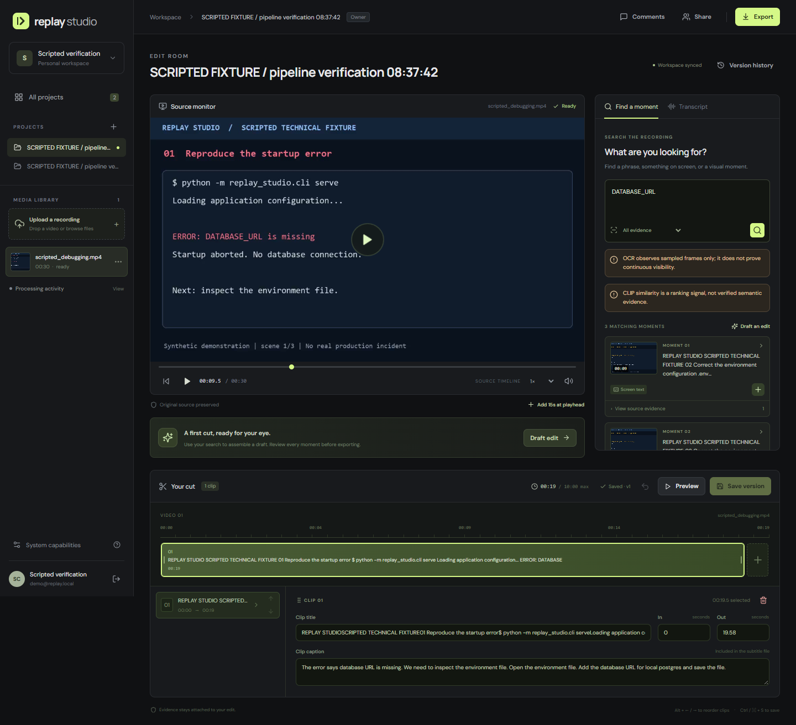

# Replay Studio

把技术录屏里的语音、屏幕文字和画面变成可核对的时间证据，再编辑、保存并导出真正的 MP4。

这是可本地运行的完整应用：React/TypeScript 工作台、FastAPI、持久任务图、真实 ASR/OCR/CLIP、可选本地 VLM 和受约束的模型剪辑建议。第一版支持单视频时间线、原音频、片段拼接与独立 SRT 字幕；项目可以包含多份素材。

> 实现与评测不是同一件事。仓库包含真实模型、媒体、故障恢复与浏览器验证；合成录屏只用于技术验收。没有把它当成真实用户研究，也没有据此宣称视觉融合优于语音基线。具体证据见 [验证报告](docs/RESULTS.md) 与 [复审记录](docs/REVIEW.md)。



## 可以实际使用的功能

- 分块上传、精确重放检查、断点续传、SHA-256、大小/项目容量限制、取消与删除。
- FFmpeg 代理、音频和采帧；保持变帧率与延迟音轨的播放时间关系。
- faster-whisper 转写、RapidOCR 屏幕文字、CLIP 画面检索；语音、语音＋OCR、融合三种可比较模式。
- 可选 SmolVLM 画面解释，明确标记为未核实推断；可选本地 LLM 只选择已存在的证据 ID。
- 真实播放器、证据跳转、片段顺序/入出点/字幕编辑、撤销、预览、不可变版本和编辑冲突处理。
- 保存版本后导出 MP4、SRT、来源清单；导出绑定该版本，后续编辑不会改变已提交任务。
- owner/editor/viewer 权限、项目共享、带素材时间戳的评论；所有媒体下载都经过权限检查。
- CPU/加速任务队列、单加速资源租约、心跳、重试、取消、旧 worker 提交隔离、阶段缓存。
- SQLite＋本地对象的轻量运行方式；PostgreSQL＋S3 的部署适配与备份恢复工具。

## 本机打开

已构建的本机演示地址为 **http://127.0.0.1:8080**。登录资料保存在忽略版本控制的 `data/demo-access.json`；只用于本机演示，不要发布该文件。预置录屏在每帧明确注明合成演示。

若服务已停止，在仓库根目录执行：

```powershell
.\scripts\start_local.ps1 -DataDirectory data/demo
```

第一次运行新工作区：

```powershell
.\scripts\start_local.ps1
```

浏览器创建首个账户即可。后续注册默认关闭；需要第二个账户时由管理员暂时设置 `REPLAY_REGISTRATION_OPEN=true` 后重启 API。项目所有者通过已有账户邮箱授予权限，不会发送邀请邮件。

## 从干净环境安装

需要 Python 3.12、Node.js 22、pnpm、FFmpeg/ffprobe。Windows x64 和 Linux x86-64 使用各自的 CPU 模型锁；Docker 文件固定 Linux amd64。模型首次运行会下载权重，离线环境应先准备模型缓存。

```powershell
python -m venv .venv
.\.venv\Scripts\python.exe -m pip install --require-hashes -r requirements-windows-cpu.lock --extra-index-url https://download.pytorch.org/whl/cpu
.\.venv\Scripts\python.exe -m pip install --no-deps -e .
pnpm --dir frontend install --frozen-lockfile
pnpm --dir frontend build
.\scripts\start_local.ps1
```

`requirements-dev.lock` 为 API/测试工具锁，不包含神经网络权重；`requirements-core.lock` 用于仅运行 API。Linux CPU 部署使用 `requirements-cpu.lock`；Linux CUDA 部署另用 `requirements-cuda.lock` 与官方 cu128 wheel 索引。不要混用 CPU/CUDA 环境中的 Torch 和 torchvision。Windows CPU 锁已在完全独立环境按哈希安装，并跑通真实三模态到导出流程；Linux/CUDA 锁仍需在对应目标环境验证。

Linux/macOS 的开发进程可分别执行 `python -m replay_studio.cli serve` 与 `python -m replay_studio.cli worker --queue all`；macOS 未做实机验证，不把 Linux/Windows 锁称为 macOS 锁。

## 生成可复现的演示

API 和 worker 使用相同 `REPLAY_DATA_DIR`。在空工作区首次创建合成演示：

```powershell
.\.venv\Scripts\python.exe scripts/generate_fixture.py --audio
.\.venv\Scripts\python.exe scripts/seed_demo.py
```

如果只启动 API、没有 worker，增加 `--run-worker` 并确保脚本数据配置与 API 相同。`seed_demo.py` 通过真实上传和处理流程运行，不向索引插入答案。已经创建其他首个账户时，改用 `verify_e2e.py` 并通过 `REPLAY_VERIFY_EMAIL/PASSWORD` 提供已有测试账户。

## 验证与工程文档

默认使用 CPU 上的 Whisper base、RapidOCR、CLIP 和确定性证据规划。开启可选 VLM 时，API 与 worker 均设置 `REPLAY_VLM_MODEL=HuggingFaceTB/SmolVLM-256M-Instruct`；可用 `REPLAY_VLM_REVISION` 固定模型 commit。它仅处理最多 12 张稀疏帧，质量与额外延迟见验证报告。

本地模型规划由 API 的 `REPLAY_PLANNER_MODEL` 指定模型 ID 或本地权重目录；`REPLAY_PLANNER_DEVICE` 只接受 `cpu`。本机已实际验证 `D:/models/Qwen3-4B-Instruct-2507` 的小输入规划。较小模型可能返回不符合契约的结果，系统会明确提示并使用确定性基线。模型返回合法空选择时保持拒答。

`REPLAY_ASR_REVISION`、`REPLAY_VISUAL_REVISION` 和 `REPLAY_VLM_REVISION` 固定远端权重；ASR 使用本地目录时不能同时指定远端 revision。设定参数前先停旧 API/worker，再让两者使用同一配置启动；已有任务仍使用提交时冻结的参数。

```powershell
.\.venv\Scripts\python.exe -m pip install --require-hashes -r requirements-dev.lock
.\.venv\Scripts\python.exe -m ruff check src tests scripts
.\.venv\Scripts\python.exe -m pytest -m 'not models' -q
pnpm --dir frontend typecheck
pnpm --dir frontend build
```

真实浏览器验收及凭证环境变量见 [前端说明](frontend/README.md)。模型权重、媒体源文件、秘密和运行数据库不进入版本库。

| 文档 | 内容 |
|---|---|
| [架构与取舍](docs/ARCHITECTURE.md) | 状态机、时间、证据、缓存与部署边界 |
| [验证结果](docs/RESULTS.md) | 实际运行、测试、负结果与证据链接 |
| [独立复审](docs/REVIEW.md) | 发现的问题、修复和回归验证 |
| [运维手册](docs/OPERATIONS.md) | Compose、模型、恢复、备份、存储回收 |
| [评测协议](docs/EVALUATION.md) | 真实素材标注、隔离切分、消融和用户试用 |
| [安全边界](docs/SECURITY.md) | 身份、上传、模型权限、部署前提 |

默认上限为单素材 512 MiB/30 分钟，项目原件与未完成上传合计 2 GiB；代理最高 1080p、2 秒采一帧、最多 900 帧；时间线最多 30 个片段/10 分钟。它们不是全局磁盘配额，模型缓存、代理、失败尝试和导出也会占空间。详见运维手册。

尚未达到原 proposal 的全部外部验收：授权的 20–30 段真实语料、150 条独立标注、5–8 人对照试用和云端持续运行仍待开展；候选窗口密集 VLM 精读、自动保存和跨素材剪辑也未实现。当前采用稀疏 VLM 描述、显式保存和单素材时间线。请以验证报告中能复现的结果作为简历依据。
