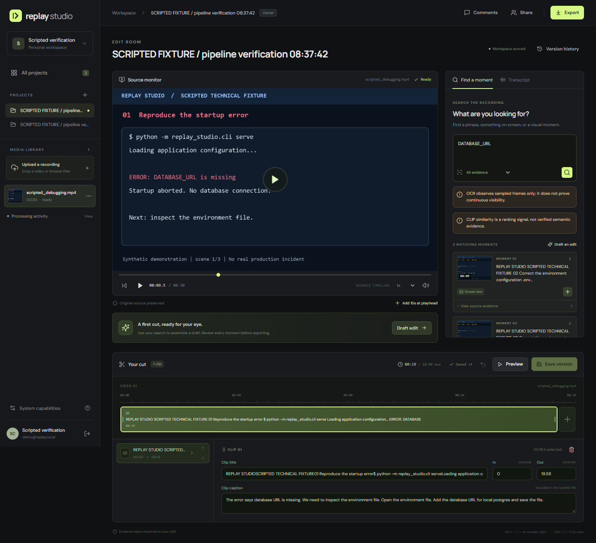

# Replay Studio

Find a moment in a technical recording, check the speech and screen evidence, then edit and export a clip with its source timestamps intact.

**React / TypeScript · FastAPI · ASR / OCR / CLIP · durable workers · PostgreSQL / S3 adapters**

[View the demo](docs/DEMO.md) · [Play a ~20-second exported sample](artifacts/demo-reviewed/output.mp4) · [Measured results](docs/RESULTS.md) · [中文说明](README.zh-CN.md)



## The problem and the workflow

A useful debugging moment may be spoken, visible only on screen, or spread across both. Replay Studio keeps those evidence types attached to the recording so a reviewer can inspect a result before using it in an edit.

1. Upload a recording; recover interrupted uploads and follow processing progress.
2. Search speech, speech plus screen text, or fused evidence; jump to the original timestamp.
3. Build a single-source timeline, adjust clip boundaries and captions, preview, then save an immutable version.
4. Export MP4, separate SRT subtitles and a source manifest bound to that saved version.

The [demo guide](docs/DEMO.md) includes committed screenshots, the actual exported clip and its source manifest. Reviewing those artifacts needs no account, model download or running server. The sample is a visibly labelled **synthetic integration fixture**, not a real production incident or a user study.

## What has been measured

| Evidence | Recorded result | What it establishes |
|---|---|---|
| Fresh Windows CPU environment | Real ASR/OCR/CLIP, HTTP upload, FFmpeg and export passed; 30-second fixture analysed in 37.578 seconds | The locked local installation completes the media workflow; cached public weights were reused |
| Automated checks | 119 backend/media/workflow tests and 3 browser checks passed in the recorded local run | Specific workflow, media timing, permission and conflict invariants |
| PostgreSQL and S3 recovery | 15 restored tables and 39 object hashes matched; login, playback, retrieval and export worked after restore | Recovery against actual services on the Windows development host |
| Small retrieval diagnostic | Speech Recall@1: 2/3; fusion: 1/3; both rejected 2/2 unanswerable queries | Fusion did not improve top-1 retrieval on this single synthetic fixture |

[Raw reports and limitations](docs/RESULTS.md) separate local integration checks, model smoke tests and retrieval measurements. These results do not establish user time savings, production scale or a general multimodal quality advantage. The [remote CI run for `cf218ef`](https://github.com/RiverHe2000/replay-studio/actions/runs/35598044321) passed backend and frontend checks; that push run did not execute the optional container job. [Current Actions results](https://github.com/RiverHe2000/replay-studio/actions/workflows/ci.yml).

## Engineering decisions

- **Evidence before generation.** ASR, OCR and visual retrieval retain source time ranges. Optional local models can select existing evidence IDs; invalid output is rejected. VLM descriptions remain visibly unverified.
- **Recoverable processing.** Persistent stage jobs use leases, heartbeats, retries and stale-worker fencing. A single accelerator lease limits resource contention; stage caches include model/configuration identity.
- **Stable edits and exports.** Optimistic version checks protect concurrent edits. Exports reference an immutable saved timeline, so later editing cannot change an in-flight render.
- **Explicit access.** Owner/editor/viewer roles protect projects and media downloads. SQLite with local storage supports development; PostgreSQL and S3 adapters have actual service and restore evidence.

The current timeline edits one source recording, with original audio and separate subtitles. Cross-source editing, automatic saving and dense VLM inspection are not implemented. The local VLM added substantial latency without a demonstrated retrieval-quality benefit. [Architecture](docs/ARCHITECTURE.md) · [Security boundaries](docs/SECURITY.md) · [Evaluation protocol](docs/EVALUATION.md).

## Run from a fresh checkout

The verified full-model installation targets **Windows x64, Python 3.12, Node.js 22, pnpm and FFmpeg/ffprobe**. FFmpeg must be on PATH. First model use downloads public weights unless already cached; this workflow needs no paid model API.

```powershell
python -m venv .venv
.\.venv\Scripts\python.exe -m pip install --require-hashes -r requirements-windows-cpu.lock --extra-index-url https://download.pytorch.org/whl/cpu
.\.venv\Scripts\python.exe -m pip install --no-deps -e .
pnpm --dir frontend install --frozen-lockfile
pnpm --dir frontend build
.\scripts\start_local.ps1
```

Open **http://127.0.0.1:8080** and create the first local account. The launcher starts the API and a separate worker against the same local data directory. Subsequent account registration is closed by default. To reproduce the scripted sample in a separate workspace, follow [the demo setup](docs/DEMO.md#reproduce-the-sample-locally) before creating an account there.

Linux CPU/CUDA locks and Docker deployment files are provided, but the complete Linux/CUDA model pipeline has not been validated on its target environment. The remote push checks do not change that boundary. macOS is unverified. See [operations](docs/OPERATIONS.md) for processes, storage, backup and deployment requirements, and [the Chinese guide](README.zh-CN.md) for detailed local model settings.

## Verify

After the CPU installation above:

```powershell
.\.venv\Scripts\python.exe -m pip install --require-hashes -r requirements-dev.lock
.\.venv\Scripts\python.exe -m ruff check src tests scripts
.\.venv\Scripts\python.exe -m pytest -m 'not models' -q
pnpm --dir frontend typecheck
pnpm --dir frontend build
```

[Browser verification](frontend/README.md#real-browser-integration-checks) uses a disposable running server and an actually processed recording. [Review notes](docs/REVIEW.md) document failure cases and fixes. Source media, model weights, local accounts and databases stay outside Git.

Default limits are 512 MiB / 30 minutes per source, 2 GiB of original and unfinished-upload bytes per project, and a 30-clip / 10-minute timeline. These are application limits, not a global storage quota. A real held-out recording corpus, independently annotated queries and external user sessions remain future work under the evaluation protocol.
