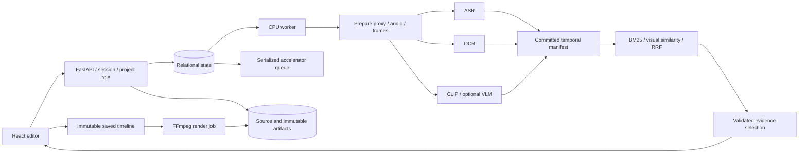

# Architecture and decisions

Replay Studio v0.1 is a single API with independent workers. PostgreSQL is the deployed metadata backend; SQLite/WAL is the local profile. Object storage can be a private S3 bucket or a local directory. Source videos and committed attempt outputs are immutable. The database decides which outputs are visible.

## 1. Database-backed workflow

The initial proposal suggested evaluating Temporal. This implementation deliberately uses transactional jobs because the bounded graph has five analysis stages and one render stage, and deployment should remain inspectable on one workstation. It is not a reimplementation of Temporal: there is no durable arbitrary workflow code, automatic external-side-effect rollback, or general event replay.

`prepare → {asr, ocr, visual} → index`; renders depend on an already committed saved run. Jobs transition queued → running → complete; failures retry up to the configured budget, then fail and block dependent work. Cancellation and asset deletion revoke completion authority. Every claim gets a random token and immutable attempt prefix. Heartbeats renew the job and accelerator resource lease. Publishing files precedes a token- and expiry-checked database commit. A crashed upload may leave orphan objects; it cannot become a visible successful attempt.

SQLite serializes writes with `BEGIN IMMEDIATE`; PostgreSQL uses row locks, `SKIP LOCKED`, and a bootstrap advisory lock. PostgreSQL concurrency needs actual integration verification, not inference from SQLite tests. The small-installation scheduler scans queued dependencies; it has not been load-tested at millions of historical jobs. FIFO is not per-tenant weighted fairness. Split queues limit resource conflicts; an accelerator queue can use CPU inference. The interactive query encoder and optional planner use CPU so they do not bypass the worker accelerator lease.

## 2. Time and evidence

The clock is normalized video presentation time. The same source video origin is subtracted from both video and audio; late audio is padded rather than independently moved to zero. VFR inputs are normalized to a 30 fps H.264/AAC proxy. Rendering accurately re-encodes segments rather than cutting only at keyframes. The provenance distinguishes normalized playback time from the original source origin and distinguishes source-upload hash from proxy hash.

Sampling is every two seconds. The FFmpeg sampling rounding mode is explicitly chosen to avoid labelling a future frame as time zero. OCR observations indicate sampled frame times, not proof of continuous screen visibility. ASR segments, OCR observations, CLIP similarity and VLM interpretations retain different provenance. The VLM is a bounded sparse-frame enrichment, not candidate-window dense video reasoning.

Search returns intervals, evidence and uncertainty. BM25-style lexical ranking and reciprocal-rank fusion avoid presenting cosine similarity as calibrated probability. A no-match query may abstain. The visual similarity threshold is a configurable baseline, not a validated global operating point.

The deterministic planner creates an evidence timeline with bounded context; it does not assert causality. An optional local language model may output only known evidence IDs. Unknown IDs, extra schema fields and invalid JSON are rejected; a legitimate empty selection is abstention. A clip cannot claim that a cited event was preserved after cutting its source interval away. Human edits are separately recorded as saved timeline versions; user subtitles are not represented as verified transcripts.

## 3. Local indexes instead of pgvector

Each run contains bounded lexical segments and a safe NumPy vector index (`allow_pickle=False`, dimensions and finite values checked). The current product searches one selected video, at most 900 frames. This keeps model identity, artifact ownership and portability straightforward. It does not provide global approximate-nearest-neighbor search over a large library. pgvector becomes useful when measured cross-video query volume warrants an independent index lifecycle.

## 4. Cache and immutable edits

A run fingerprint includes source hash, pipeline version, stage enablement, model IDs/revisions, language, device and dependency versions. Each stage has its own cache key; changing visual settings reuses unchanged successful prepare/ASR/OCR stages. Unavailable models, including nested VLM failure, are not successful cache entries. A corrected sampling algorithm bumped the pipeline version to 2, invalidating earlier artifacts.

The API freezes settings at submission and workers apply that profile; changing a worker default cannot silently change queued work. Unpinned model IDs can still resolve to changed upstream weights on a different machine; set revision variables and preserve model cache/revisions for reproducible deployments. Dependency locks do not pin hosted weights.

A project revision is advanced with compare-and-swap. Timelines are immutable snapshots, not mutable clip rows. A 409 never silently overwrites another editor. UI polling does not replace dirty edits; edits made during an in-flight save remain dirty. Export payloads freeze asset, run, version and clips. Restoring an earlier revision creates a new revision.

## 5. Asset and security boundaries

All object access is routed through authenticated project authorization. Object keys are not bearer credentials. Bounded chunk upload locks the row, verifies replay bytes and fsyncs staging data before committing its offset. After a crash it discards bytes beyond the committed offset. Finalization verifies length and hashes the source. Cancellation frees the reserved quota and fences late appends/finalization.

Asset deletion first revokes access and cancels work transactionally. Physical deletion is an explicit quiesced maintenance operation; it must not race with a still-exiting worker. Historical database rows remain for audit. Deleted content may persist in backups according to the operator's retention policy.

First-account setup is serialized. Passwords use salted PBKDF2; session tokens are random and only their hashes are persisted. Same-origin HttpOnly cookies, CSRF tokens, origin checks, role checks and authentication rate limits enforce independent boundaries. See SECURITY.md for deployment assumptions.

## 6. Scope and consequences

The application has a real editor and durable workflow, but it is not a general professional video editor, CRDT collaboration system or a multi-region service. It supports one source per saved timeline, explicit save, original audio, captions as SRT and simple concatenation. The proposal's dense candidate VLM pass, drag handles, autosave, cross-video narration, full metrics stack and long-term cloud/user validation remain future work. They must not be implied by a screenshot or a synthetic benchmark.
